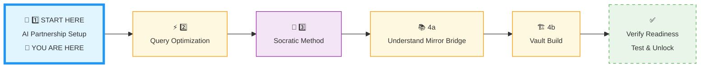
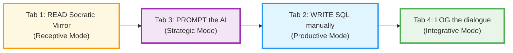
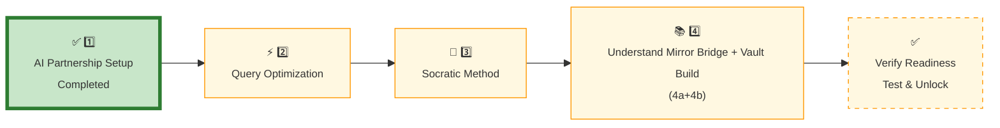
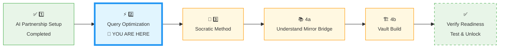
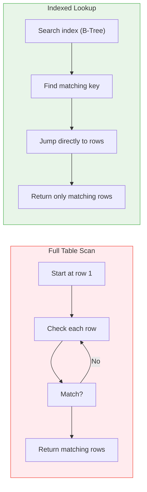
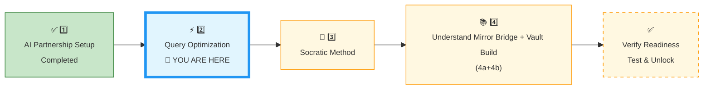
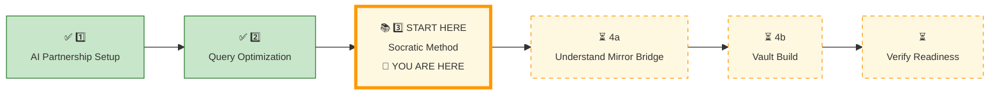
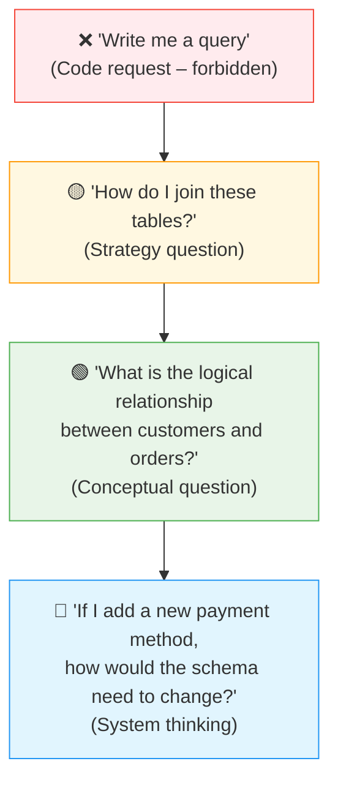
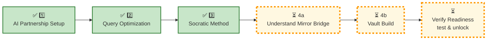

# 🗄️🤖 SQL & GenAI Course
**🎯 Quality Education for Anyone, Anywhere, Anytime — 💫 with Comfort, Convenience at no Cost**

---

## 🤖 **1 AI PARTNERSHIP SETUP: ACCELERATE Phase Calibration**


## 📍 **YOUR PILLAR PROGRESSION**
**Current Status:** Beginning the ACCELERATE Framework • Pillar 1 of 4




---

## 🎯 **Quick Win Promise**

**In the next 20-30 minutes,** you'll configure your AI as a **Socratic mentor** – a partner that sharpens your thinking, never writes code for you. You will establish the "No‑Code" protocol and create your **Socratic Log** space in your Vault.

The **AI** is your **Senior Architect.** It explains logic, suggests strategies, and **validates your reasoning.** You write every line of **SQL yourself.**

**Your Goal:** ACCELERATE‑ready AI partnership with guardrails, a configured persona, and a structured logging workflow for every dialogue.

 
---

## 📋 **Prerequisites & Quick Checklist**

**Before starting this pillar, confirm:**

- [x] **ACQUIRE Completion** is finished (your Skill‑Tree database is populated).
- [x] You have your AI platform ready (ChatGPT, Claude, or Gemini).
- [x] Your Vault (GitHub) repository workspace is open in Tab 4.

> ⚠️ **If you have not completed ACQUIRE Completion, stop here.** Go back to `SECTION1_COMPLETION.md` and finish that first. ACCELERATE builds directly on your Skill‑Tree database.

---

## 🏢 **ACCELERATE PHASE: The AI Partnership Configuration**

**🚀 ACCELERATE MANDATE:**  
**Socratic Guidance | No Code Generation | Strategy Over Syntax | Dialogue Logging**

### **📋 ACCELERATE-Specific Tab Configuration**

| Tab | **ACCELERATE Purpose** | **ACCELERATE Restrictions** | **Save Rule** |
| :--- | :--- | :--- | :--- |
| **1: The Map** | ACCELERATE instructions & Socratic Mirror files | Reference only | 🚫 No saving here |
| **2: The Factory** | **Write SQL manually** after AI logic | No AI‑generated code pasted here | 💾 Copy to Tab 4 |
| **3: The Consultant** | **Socratic guidance ONLY** | ❌ Never ask for code | 📋 Log all dialogues in Tab 4 |
| **4: The Vault** | Socratic Journal & ACCELERATE logs | Structured `ACCELERATE/` layout | ✅ Everything here |

**Pro Tip:** Use `Ctrl+3` / `Cmd+3` to jump to your AI Consultant – but remember: ask for logic, not code.

### **📅 Your 4‑Day ACCELERATE Calibration Ritual**

**Total Time:** 2–3 hours over 4 days → **Result:** A calibrated AI partnership for Module 5.

| Pillar | Duration | Core Focus | **Calibration Outcome** |
| :--- | :--- | :--- | :--- |
| **🤖 1. AI Partnership Setup** | Day 1 | Guardrails, Persona & Socratic Journal boundaries| **AI as Mentor:** A configured co‑pilot that never writes code. |
| **⚡ 2. Query Optimization** | Day 2 | Efficiency Patterns & Anti‑Patterns | **Speed Mindset:** Prompt for performance, spot AI hallucinations. |
| **🧠 3. Socratic Method** | Day 3 | Prompting Ladder, Validation, Context Feeding | **Critical Thinking:** Extract reliable logic from any AI. |
| **📚 4a. Mirror Bridge** | Day 4  | Structural isomorphism (ACQUIRE ↔ ACCELERATE) | Pattern Recognition |
| **🏗️ 4b. Vault Build** | Day 4  | Folder setup, workspace creation, verification test | ACCELERATE Ready |


### **🧠 ACCELERATE Cognitive Workflow**



**ACCELERATE GOLDEN RULE:**  
**You write every line of SQL manually. AI explains logic only. Never ask for code.**

---

## ⏱️ **Step-by-Step ACCELERATE Calibration**

### **🔍 Choose Your Path & Verify Readiness**

**Before ACCELERATE calibration, verify your ACQUIRE Completion is ready:**

- [ ] Your Skill‑Tree database has `phases_level1`, `modules_level1`, `skills_level1` tables.
- [ ] You have at least 10 skills and 5 insights logged.
- [ ] You can successfully run `SELECT * FROM skills_level1;` in Tab 2.
- [ ] Your database file is saved in your Vault.

**All checked? → Proceed to Phase 1.**  
**Missing checks? → Complete `SECTION1_COMPLETION.md` first.**

---

## 🎯 Phase 1: Configure AI Persona for ACCELERATE

**Focus:** Establish the “No‑Code” protocol and configure your AI as a Socratic mentor.

### Step 1: Complete the Browser Office Context Setup

Before configuring the persona, you must feed the AI the necessary context (character stories and database schemas).

👉 Follow the instructions in **[`BROWSER-OFFICE-ACCELERATE.md`](../../Module5-GenAI-Walkthrough/BROWSER-OFFICE-ACCELERATE.md)**.

This file guides you through:
- Feeding the SQLVerse character stories
- Loading generic schema anchors (Modules 2 & 3)
- Understanding the two‑tier context strategy

> 💡 Complete this **before** moving to Step 2.

---

### Step 2: Copy the AI Persona Prompt

Once the context is loaded, configure the AI persona.

👉 Follow the instructions in **[`AI_PERSONA_PROMPT.md`](../../Module5-GenAI-Walkthrough/AI_PERSONA_PROMPT.md)**.

That file contains:
- The complete persona prompt
- Veracity check (hallucination prevention)
- Quick test to confirm the persona is working
- Recovery protocol for when AI writes code

---

### Step 3: Verify the Persona

After completing the persona setup, ask the AI a Socratic question to confirm it responds with logic, not code.

**Example test prompt (Training Institution):**  
*“How would I find the names of students who are enrolled in courses taught by instructor_id 501?”*

**Expected response:** Logic and strategy – no SQL code.

If the AI writes code, remind it: *“Explain the logic, don’t write SQL.”*


---

## 📓 **Phase 2: Master the Logging Systems**

**Focus:** Understand where regular lessons and specialized AI errors live to build a pristine portfolio.

### **Step 1: Map Out the Architecture Paths**

In your Vault (Tab 4), your structural work will look like this:

```
Portfolio Root/
└── Learning/
    └── Level-1-beginner/
        └── ACCELERATE/
            ├── 📁 01-The-Socratic-Mirror/     # Regular day-to-day logs
            │   └── 📁 ACQUIRE-MODULE2/
            │       └── 📄 1-the-sieve-select.md # Strict 1:1 filename mapping
            └── 📁 Socratic_Journals/          # Specialized Error Hub ONLY
                ├── 📄 hallucination_log.md
                └── 📄 edge_case_anomalies.md
```

### **Step 2: Apply the Quick Summary Format for Regular Entry Logs**

For all regular day-to-day logs stored inside `01-The-Socratic-Mirror/`, use this precise and concise format to document your work cleanly without pasting massive raw text transcripts:

```markdown
# 🪵 Socratic Log: [Insert Exact Lesson Name]

### 🧭 Context Anchor
* **Target Database:** [e.g., toll_booth_analytics.db]
* **Core Concept:** [e.g., Filtering with WHERE clauses]

### 🪜 The Inquiry Ladder
* **The Structural Question:** [What conceptual question did you ask the AI to avoid getting direct code?]
* **AI Guidance Path:** [One or two sentences on the logic or strategy the AI suggested]

### 🛠️ Verified Implementation
```sql
-- Your hand-written, verified SQL query goes here

```

### 📋 The Entry Delta

-   **Before:** [Your initial understanding or approach to the problem]
    
-   **After:** [The optimized insight or structural layer realized via the AI conversation]

> 💡 **Future‑Proofing:** Keep your Socratic Journals tidy! In **Module 5 (Completion)** , you will migrate these logs into your actual Skill‑Tree database to build a searchable history of your AI‑assisted logic.


### **Step 3: Keep the Error Hub Clean**

**`Socratic_Journals/` is reserved only for capturing unusual AI anomalies.** Every time you catch the AI hallucinating or tripping over a SQLite edge case, document it in `hallucination_log.md` using the specialized layout. Regular daily dialogues never go here.

---


## 🚫 **Phase 3: ACCELERATE Guardrails – What to NEVER Ask**

**Focus:** Internalise the boundaries that make this partnership effective.

| ❌ Never ask | ✅ Instead ask |
|--------------|----------------|
| “Write me a query that…” | “What is the logical relationship between these tables?” |
| “Fix this SQL for me” | “What could cause this error? Hint me, don’t fix it.” |
| “Generate a schema for…” | “Based on my 3NF design, what entities should I consider?” |
| “Give me the answer” | “Guide me through the steps to discover the answer.” |

---

###  🧠 **The Artisan’s Veracity Check**  

 If the AI suggests a logic pattern or a specific SQL function you haven’t seen before, ask the AI for the official documentation link or a “Logic Stress Test” question to validate the suggestion for SQLite.

We have discussed this in detail in **AI_PERSONA_PROMPT** markdown file you used in **Phase 1.**

> *“The AI is your co‑pilot, not your autopilot.”*

---

## 🔄 Recovery Protocol (When AI Accidentally Writes Code)

If the AI generates SQL (even by accident), Redirect the AI to explain the logic and continue. We have discussed the **Workflow for Recovery Protocol** in **AI_PERSONA_PROMPT** markdown file you used in Phase 1.

---

## 🧠 **Deep Philosophy: The ACCELERATE Mindset**

<div align="center" style="border: 2px solid #ff9800; border-radius: 8px; padding: 20px; margin: 20px 0; background: #fff8e1;">

### **🚀 Foundation First, AI Next, Projects Last.**
### **💎 Gemstone by Gemstone, Skill by Skill.**

</div>

**Your ACCELERATE Mandate:**  
**Socratic Guidance | No Code Generation | Strategy Over Syntax | Dialogue Logging**

### **Why the “No‑Code” Protocol Builds Real Skill**

**The Paradox of AI Assistance:**
- **If AI writes code → You learn dependency.**  
- **If AI explains logic → You learn strategy.**

**ACCELERATE Phase trains you to:**
- **Think in relationships** (foreign keys, join logic) before writing syntax.
- **Validate AI suggestions** against your own manual mastery.
- **Own every line of code** you write.

### **The Socratic Journal Is Your Proof**

**What most students have:**  
- A folder of AI‑generated queries they don’t fully understand.

**What you will have:**  
- A **log of reasoning** – problem → AI guidance → manual SQL → reflection.  
- Evidence that you **lead the AI**, not the other way around.

> *“The master doesn’t ask ‘What’s the code?’ The master asks ‘What’s the logic?’”*

---
### 🔍 The “No‑Code” Protocol – At a Glance

| Your Role | AI’s Role |
|-----------|-----------|
| Write every line of SQL manually | Explain logic, never write code |
| Decide which join type to use | Explain the difference between `INNER` and `LEFT` JOIN conceptually |
| Build the final query | Validate your reasoning with questions |
| Log the dialogue in your Socratic Journal | Suggest strategies and edge cases |

> *“You are the Artisan. AI is your sharpening stone.”*

---

## 🔧 **ACCELERATE Tool Mastery Challenge**

<div style="border: 3px solid #9c27b0; border-radius: 10px; padding: 25px; margin: 30px 0; background: linear-gradient(135deg, #f3e5f5 0%, #e1bee7 100%); box-shadow: 0 8px 20px rgba(156, 39, 176, 0.2);">

### **🧪 Test Your AI Partnership Boundaries**

**Time:** 10 minutes  
**Objective:** Prove you can interact with the AI without breaking the “No‑Code” rule.

#### **🎯 The 3‑Part Boundary Test:**

**Part 1: Prompt Discipline (3 minutes)**
```markdown
Ask the AI a SQL question. It must **not** write code. If it does, correct it with:
“Please explain the logic, don’t write SQL.”

Write the AI’s response here (should be strategy only):
```

**Part 2: Journal Entry (5 minutes)**
```markdown
Create a journal entry for the dialogue above using the template.
```

**Part 3: Guardrail Recall (2 minutes)**
```markdown
List 3 things you must NEVER ask the AI:
1.
2.
3.
```

#### **📊 ACCELERATE Partnership Score:**
- **Perfect (all checks):** Excellent AI discipline → Proceed to Query Optimization.
- **Needs Practice:** Repeat the test until the AI never writes code.

**Your Score:** ___ / 3

</div>

---

## 🌱 What This Opens Up Later

Your Socratic AI partnership is not just for ACCELERATE. It lays the foundation for professional‑grade data engineering workflows:

- **AI‑assisted query tuning** – Ask the AI to reason about performance without rewriting your SQL.
- **Execution plans** – Have the AI explain how a query executes, step by step.
- **Indexing strategy** – Let the AI suggest where indexes would help, then you implement them.
- **Prompt engineering for analytics** – Craft prompts that extract deeper business logic from complex schemas.
- **Schema generation critique** – Feed your schema to the AI and ask: “What would you improve, and why?”
- **AI audit workflows** – Use the AI to verify that your queries meet compliance rules (e.g., no accidental cross‑joins).
- **SQL debugging conversations** – Paste an error message and ask for possible causes – without asking for the fix.
- **Business requirement extraction** – Describe a business goal in plain English; let the AI translate it into a logical query structure.
- **Multi‑step reasoning pipelines** – Break a complex reporting task into a chain of logical steps before writing any SQL.

All of this stays true to the **“No‑Code” protocol** – the AI guides, you build. Your Skill‑Tree database and Socratic Journal will be the evidence that you lead the AI, not the other way around.

> 🔮 **Level 2 Preview:** These are not requirements for ACCELERATE. They are a glimpse of the professional workflows you will master in the next phase.

> *“The Artisan doesn't ask for the answer. The Artisan asks for the path.”*

---

## 🚀 **Your Calibration Navigation Journey**

**Complete ALL 4 pillars in sequence to unlock Module 5:**



### **🔄 Navigation Controls:**

**⬅️ Previous Step:** You came from [SECTION2_INDUCTION.md](../SECTION2_INDUCTION.md)

**➡️ Next Step:** Continue your calibration with Query Optimization

<div align="center" style="border: 3px solid #9c27b0; border-radius: 10px; padding: 25px; margin: 30px 0; background: linear-gradient(135deg, #f3e5f5 0%, #e1bee7 100%); box-shadow: 0 8px 20px rgba(156, 39, 176, 0.2);">

### **🎯 AI Partnership Setup Ready**

**After you pass the Tool Mastery Challenge, continue to Query Optimization**:

Your **persona** is set. Your logging system boundaries are drawn. Now, let's learn how to make your **queries**—and your prompts—**lightning fast.**


# [▶️ **NEXT: QUERY OPTIMIZATION**](./2_Query_Optimization.md)

**Learn efficiency patterns, anti‑patterns, and how to prompt for performance**

<small>⏱️ *Estimated time: 20-25 minutes*</small>

</div>

**🚫 Module 5 remains locked until ALL 3 calibration steps are complete.**

---

*Part of our mission for 🎯 Quality Education for Anyone, Anywhere, Anytime — 💫 with Comfort, Convenience at no Cost.*


--------------

----------------------------


--------------------------------------


# 🗄️🤖 SQL & GenAI Course
**🎯 Quality Education for Anyone, Anywhere, Anytime — 💫 with Comfort, Convenience at no Cost**

---

## ⚡ 2 QUERY OPTIMIZATION: The Speed of Logic


## 📍 YOUR PILLAR PROGRESSION
**Current Status:** Continuing the ACCELERATE Framework • Pillar 2 of 4



---

## 🎯 Quick Win Promise

**In the next 20-30 minutes,** you will learn how to use your **Socratic AI** mentor to **identify** performance bottlenecks, avoid common anti‑patterns, and **reason clearly** about query execution order. You will also learn to **recognize** and challenge **AI hallucinations** regarding SQLite performance limitations.

**Your Goal:** Confidently **extract** performance‑related **architectural logic** from your AI partner without writing or copying a single line of external code.

---

## 🧠 Phase 1: Understanding Performance Patterns

### 📖 Execution Order Refresher

SQL does not run your query in the top-to-bottom sequence you write them. The logical execution order is:

1. `FROM` / `JOIN` – Gather the raw source tables and combinations
2. `WHERE` – Filter rows at the earliest possible stage
3. `GROUP BY` – Agglomerate data into structural groups
4. `HAVING` – Filter those generated groups
5. `SELECT` – Project columns and resolve aliases
6. `ORDER BY` – Sort the resulting output records
7. `LIMIT` – Trim the final response payload

**Why this matters for performance:**  
Reducing rows earlier in the execution pipeline often helps the optimizer do less work.

---

## ⚡ Introduction to Indexes: The Speed Pillar

### 🎯 The Core Concept

An **Index** is a dedicated database structure that that **accelerates** data retrieval at the cost of additional disk storage and marginally slower data modification speeds. Without an index, database engine must execute a **Full Table Scan**, checking every single row to find a match.


### 🛠️ The Artisan’s Metaphor

- **The Library (Table):** Millions of multi-colored books piled randomly across vast warehouse shelves.
- **The Full Scan:** Walking past every single book title one by one to find a book by a specific author.
- **The Index:** The structured **Card Catalog** at the entry lobby. You look up the author’s name (the indexed column) to find the exact shelf and position of the book instantly.

### ⚙️ How the Query Optimizer Works

Behind every query, the database engine's **Query Optimizer** **maps out**  the fastest way to **fetch** your data. It weighs two core execution paths:



- **Full Table Scan (Red Path):** The database traverses **every row** in the table. Fast for tiny tables, disastrous for large ones; **catastrophic** for production **scaling**.

- **Indexed Lookup (Green Path):** The database navigates an **index** (like a card catalog) to jump straight to the matching rows. Extremely fast for targeted, selective searches.

> *“The optimizer chooses the green path when an index exists and the query is selective. Without an index, it has no choice but to walk the red path.”*

In the **SQLVerse**, an **index** isn't just a technical feature; it is the **Architectural Compass**. It allows a data artisan to **navigate** millions of rows without getting lost in a full table scan. It separates brute-force scripting from professional **database engineering.**

---

## 📖 **The Artisan’s Secret: The Index**

Imagine **Annie** is scanning a massive, automated e‑commerce warehouse layout looking for a specific vintage dress variant stored inside the `products` table: – our E‑store database.

- **The Amateur Way (Full Table Scan):** Annie walks down every single aisle (from aisle 1 to aisle 10,000 manually), checking every single box until she finds the dress. This works for 10 boxes, but completely crashes the operation when dealing with 10 million distinct SKUs.

- **The Artisan Way (The Index):** Annie references a high-speed **master ledger** at the front of the warehouse. The ledger lists **"Vintage Dresses"** and tells her exactly which aisle and shelf to go to. She **bypasses** the search and executes immediate retrieval.

---

### 📋 Key Points for ACCELERATE

**1. The "Why" (Performance Patterns)**  
Indexes are essential for columns frequently used in `WHERE` clauses, `JOIN` conditions, and `ORDER BY` statements.

**2. The "Trade‑off" (The Cost of Speed)**  
An Engineering Artisan recognizes that every tool has a cost attached to it:
- **Storage Cost:** Indexes take up extra disk space.
- **Write Latency:** Every time you `INSERT`, `UPDATE`, or `DELETE`, the database must also update the index to re-balance the index tracking structure.

**3. The Socratic Challenge**  
Instead of asking for code samples, challenge your AI mentor with strategic scenarios:

> *“In Raj’s Library database, if we frequently search for books by their `ISBN` or members by their `email`, which operation would be faster: searching a table with an index on that column, or a table without one? What happens to the speed of adding a new book or member?”*

Indexes **bridge** the gap between understanding how to **write a query** and how to **make a query perform** like a professional.

> 🔮 **Level 2 Preview:** Some queries benefit from indexes across multiple columns – called composite indexes. You will master them in Level 2.

---

## 🛠️ **Optimization Patterns & Anti‑Patterns**

Leverage these structural boundaries with your AI Consultant to master **indexing** and **access patterns**.

### **1. The Selective Search (Indexes)**

**Concept:** Use an index on columns you search often (like `email`, `order_id`, or `product_sku`).

- **Socratic Question to AI:** *“If I frequently filter Raj’s tourism data by 'travel_date', how does an index change the way SQLite handles the query underlying execution path?”*
- **The Trade‑off:** Every index makes `SELECT` faster but makes `INSERT` slightly slower (because the ledger must be updated). Always evaluate whether **read-frequency** justifies the minor **write-performance penalty** on your specific table.

### **2. The "Surgical" SELECT**

**Concept:** Eliminate `SELECT *` from your production vocabulary. Only ask for the columns you need.

- **Anti‑Pattern:** `SELECT * FROM orders;` (Annie drags the whole structural warehouse to the pickup counter).
- **Optimization:** `SELECT order_date, total_amount FROM orders;` (Annie only pulls the two parameters needed for the receipt).

### **3. The Hallucination Check**

**Concept:** Large Language Models frequently blend **multi-engine SQL syntax**, recommending operations unsupported by the local environment (SQLite in our case).

- **The Integrity Test:** If the AI suggests `DATEDIFF()` or `CONCAT()`, ask: *“Is that native SQLite syntax, or should I use `JULIANDAY()` and the `||` operator?”*

---

### ⚠️ Common Performance Anti‑Patterns

| Anti‑Pattern | Why It’s Bad | What to Ask the AI |
|--------------|--------------|---------------------|
| `SELECT *` | Returns unnecessary columns, Pollutes memory buffers, increases disk I/O, and wastes network bandwidth. | “What are the structural architectural risks of utilizing `SELECT *` in an application production layer?” |
| No `LIMIT` during exploration | Risks fetching millions of records, crash browser or server | “Why is a defensive `LIMIT` boundary standard practice when inspecting unfamiliar datasets?” |
| Missing `ON` clause | Triggers an accidental Cartesian product (combines every row with every other row). | “What happens if I forget the `ON` clause in a JOIN?” |
| Filtering after join | More rows processed than necessary | “How does moving a filter statement from a `HAVING` phase into a `WHERE` phase alter resource consumption?” |
| Using functions in `WHERE` | Prevents index usage (e.g., `WHERE DATE(created_at) = '2025-01-01'`). Invalidates indexing utility by forcing the engine to calculate a function value for every row (sargability failure) | “Why does running an explicit operation like `WHERE DATE(created_at) = '2025-01-01'` break index efficiency?” |

---

## 🧪 Phase 2: Example – Prompting About a Slow Query

### Case Analysis – Strategic Bottleneck Spotting

**Instead of a hands‑on exercise, we show an example.**

**Scenario:** You encounter a legacy analytical query that is lagging heavily:

```sql
SELECT * FROM orders o, customers c WHERE o.customer_id = c.customer_id AND o.order_date > '2025-01-01';
```

**An exact Socratic verification prompt for your AI Consultant (Tab 3):**

> *“Without rewriting this query or outputting any SQL syntax, analyze the performance risks present here. What legacy join pattern is being used, why does it complicate query planning for the optimizer, and what approach provides a clean alternative?”*

**The expected structural conceptual breakdown from your AI:**

- The comma‑join (`FROM orders o, customers c`) is an old‑style cross join with a filter in `WHERE` – harder for the optimiser.
- Suggest using explicit `JOIN` syntax (`FROM orders o JOIN customers c ON ...`). Moving to **standard, readable, explicit ANSI** join notation is the best solution.
- Explain that filtering early (within `ON` or as early as possible) is better.

> 💡 *“The Artisan doesn’t just write queries. The Artisan writes queries that scale.”*

---

## 🛡️ Phase 3: Guardrails & Anti‑Patterns

### Strategy Application

Use the table in Phase 1 as a reference. When diagnostic analysis indicates a slow query, ask the AI:

> *“Without rewriting my query or providing an updated script, explain which anti‑pattern might be causing it to run slowly. Walk me through the execution steps.”*

**Remember the Veracity Check:** If the AI suggests a performance trick you’ve never heard of (e.g., “use `WITH` clause for magic speed”), ask: *“Is that valid for SQLite? Explain the trade‑offs.”*

---

## ✅ Tool Mastery Challenge

**Time:** 5 minutes

**Objective:** Deconstruct an indexing execution path using your AI Consultant.

**Scenario:** You are querying the `enrollments` table (1 million rows) to find students enrolled in a specific course.

**The Bottleneck:** The database is checking every row one by one – a full table scan. The database execution logs show a full table scan occurs on every runtime request.

**Your Task:** Have a Socratic dialogue with your **AI Consultant** (Tab 3)  and fix the problem.

### 🎯 Your Challenge Action Steps:

**Step 1: Prompt Your AI Consultant (Tab 3):**

> *“I have a million rows in `enrollments`. What is the fundamental logical difference between a **‘Full Table Scan’** and an **indexed lookup** when I’m looking for a specific `course_id`?”*

**Step 2: Follow Up on Resource Allocation**

> *“What is the specific architectural trade-off here? If I add an index on `course_id`, what happens to the speed of inserting a new enrollment?”*

**Step 3: Log Your Insights**

Take the conceptual core of your conversation and log it inside your Vault workspace (`Tab 4`) at the path: `ACCELERATE/01-The-Socratic-Mirror/ACQUIRE-MODULE2/2-query-optimization-patterns.md` using the clean, concise **Quick Summary Format**.


### **Pillar 2 Completion Checklist:**
- [ ] I asked about the performance difference without requesting code.
- [ ] The AI explained the concept of indexed lookup vs full table scan.
- [ ] The AI described the trade‑off (faster reads, slower writes).
- [ ] I logged the exchange in my Socratic Journal.

---

## 🌱 What This Opens Up Later

Mastering query execution theory equips you to cleanly handle advanced architecture layers in **Level 2**:

-   Complex performance auditing tasks (`EXPLAIN QUERY PLAN` analysis).
    
-   Multi-column strategy deployment (Composite and Covering Indexes).
    
-   Engine-level storage differences (SQLite B-Trees vs. PostgreSQL execution strategies).

> *“The Artisan doesn’t just make queries work. The Artisan makes them work fast.”*

---

## 🚀 Your Calibration Navigation Journey

**Complete ALL 3 pillars in sequence before Module 5:**



### 🔄 Navigation Controls

**⬅️ Previous Step:** You came from [1_AI_Partnership_Setup.md](./1_AI_Partnership_Setup.md)

**➡️ Next Step:** Continue your calibration with Socratic Method

<div align="center" style="border: 3px solid #ff9800; border-radius: 10px; padding: 25px; margin: 30px 0; background: linear-gradient(135deg, #fff8e1 0%, #ffe0b2 100%); box-shadow: 0 8px 20px rgba(255, 152, 0, 0.2);">

### 🎯 Query Optimization Calibration Complete

**After you pass the Tool Mastery Challenge, continue to Socratic Method:**

Now that you know how to make queries fast, it's time to learn how to make your **prompts** even faster. Let us accelerate your actual communication pipeline with your AI mentor. In the next file, we unpack the **Inquiry Prompting Ladder**.


# [▶️ **NEXT: SOCRATIC METHOD**](./3_Socratic_Method.md)

**Learn the Prompting Ladder, validation checklist, and context feeding**

<small>⏱️ *Estimated time: 20-25 minutes*</small>

</div>

**🚫 Module 5 remains locked until ALL 3 calibration steps are complete.**

---

*Part of our mission for 🎯 Quality Education for Anyone, Anywhere, Anytime — 💫 with Comfort, Convenience at no Cost.*

**Level 1 | ACCELERATE Induction | Query Optimization**


--------------

---------------------

---------------------------------


# 🗄️🤖 SQL & GenAI Course
**🎯 Quality Education for Anyone, Anywhere, Anytime — 💫 with Comfort, Convenience at no Cost**

---

## 🧠 3 SOCRATIC METHOD

### The Prompting Ladder & Validation

In this pillar, you will learn how to **ask the right questions** – prompting the AI for logic, not code. You will climb the Prompting Ladder, use a validation checklist to spot hallucinations, and master the art of context feeding.

*The Artisan doesn’t ask for the answer. The Artisan asks for the path.*

---

## 📍 YOUR PILLAR PROGRESSION
**Current Status:** Continuing the ACCELERATE Framework • Pillar 3 of 4


---

## 🎯 Quick Win Promise

**In the next 20-25 minutes,** you will master the **Socratic Method** – the art of prompting and provoking strategic logic from your AI partner, validating the responses, isolating systemic edge cases, and feeding context efficiently. You will learn to climb the **Prompting Ladder**, run live sanity verifications, and manage context across databases.

**Your Goal:** Confidently ask questions that produce **pure architectural strategy, not code** – and know how to verify that the AI’s advice is accurate for SQLite.

---

## 🧠 Phase 1: The Prompting Ladder

Not all prompts are created equal. The Socratic Method is about  intentionally **climbing the ladder** – from vague requests to precise, logical inquiries.



| Level | Prompt Type | Objective | Example |
|-------|-------------|-----------|---------|
| 1 | The Surface Trap | Surface troubleshooting | “I’m stuck understanding how JOIN logic matches up lines.” |
| 2 | Concept Extraction | Structural mechanics | “Explain the abstract difference between INNER and LEFT JOIN operations.” |
| 3 | Relationship Isolation | Entity map mapping | “What is the underlying cardinality and relationship between students and enrollments?” |
| 4 | System Architecture | Structural impact simulation | “If I append a new course variant to the platform model, how does that update propagate through the database schema?” |


---

## 🧪 Phase 2: Validation Checklist – Spot AI Hallucinations

After receiving any strategy breakdown from your AI Consultant, immediately pass its response through this **5-Point Sanity Protocol** before beginning manual query assembly:

| # | Sanity Query | Objective | Why It Matters |
|---|--------------|-----------|----------------|
| 1 | “Does this logic implicitly handle NULL records safely?” | Access Stability | Prevents unexpected empty arrays and silent data drop-outs. |
| 2 | “What internal edge cases break this specific design?” | Edge Case Analysis | Forces immediate consideration of empty states, single-row anomalies, and boundary values. |
| 3 | “Is this strictly valid native SQLite syntax?” | Engine Sanity | Exposes hallucinated external engine operators like DATEDIFF or NVL. |
| 4 | “Does this structure scale gracefully if the dataset hits millions of records?” | Performance Sizing | Surfaces full table scans and unsargable structures before deployment. |
| 5 | “What structural assumptions are you making about my tables?” | Bias Isolation | Clears hidden logic assumptions regarding column defaults or key uniqueness. |

---

### 🔍 **Case Study: Intercepting an Optimization Hallucination**

**The AI may confidently recommend:**

```sql
SELECT TOP 5 product_name, price
FROM products
ORDER BY price DESC;
```

**Your  Automated Validation Check:**  
*“Is that valid SQLite syntax? What should I use instead?”*

**Correct response:** SQLite does not support `TOP 5`. It uses `LIMIT 5` at the end of the query.

```sql
SELECT product_name, price
FROM products
ORDER BY price DESC
LIMIT 5;
```

> *“The Artisan never trusts blindly. The Artisan verifies every logical pass.”*
> *“Verification is the difference between AI assistance and AI dependency.”*


---

## 🔄 Phase 3: Context Feeding & Memory Reset

### For Modules 2 & 3 (Anchored Generic Context)

Feed the AI the fundamental core schemas **once** at the start of ACCELERATE:

- `SCHEMA_ANCHOR_TRAINING_INSTITUTION_SAMPLE.md`
- `SCHEMA_ANCHOR_LEVEL1_ESTORE_BASIC.md`

Tell the AI: *“These are the core schemas for ACCELERATE.  These profiles serve as my global schemas for ACCELERATE operations. Remember them.”*
 
### For Module 4 (File‑Specific Context Extraction)

Each Socratic Mirror file in `ACQUIRE-MODULE4/` contains a **Context box** pinned to its header at the top. Copy and paste it into the AI **before** asking questions.

**Example from `5-SelfJoin.md`:**

> **Database:** `level1_estore_self_join.db`  
> **Tables:** `employees` (employee_id, name, manager_id)  
> **Business problem:** Find employee–manager relationships using a self join.

---

### 🔄 Reset Instruction – Critical for Module 4

🧹 **The Memory Eraser Protocol – Crucial for Isolated Datasets**

When shifting focus between distinct Module 4 schemas (e.g., executing a jump from `level1_estore_self_join.db` over to `tourism_planet_self_join.db`), you must **explicitly force** an a**ctive clear** of the  AI's active working memory.

Say this exact phrase:

> *“Discard previous specific table structures for Module 4. Here is the new context for [Concept Name].”*

⚠️ **Artisan Warning:** Skipping this memory flush causes the language model to synthesize tables from separate databases, outputting fragmented, hallucinated architecture models.

---

**📋 Context Eraser Template (Copy-Paste):**

```text
Discard previous specific table structures for Module 4. Here is the new context for [Concept Name].
```

**Example:**  
> *“Discard previous specific table structures for Module 4. Here is the new context for Self Join.”*

**Action:** Paste this into your AI Consultant before pasting a new context box.

---

### 📦 Prompt Compression vs. Expansion Dynamics


**Context Compression** (Leveraged inside shared systems like Modules 2 & 3):

> *“Same schema. Maintain existing loaded schema parameters. Now optimise for NULL-safe aggregation.”*

**Context Expansion** (when switching databases – Module 4 Required when executing jumps across Module 4 databases):

> *“New tourism schema. Reset previous context. Execute schema wipe. Erase past transactional contexts. Here are the fresh tables, relationships, and operational business goals.”*

> ## 💡 Pro Tip
> 
> **“Compression saves time. Expansion prevents confusion. Know when to use each.”**

---

🧠 **The Artisan’s Anti‑Hallucination Principle**

The quality of AI output is constrained by the quality of context and reasoning supplied by the Artisan. Not better prompts alone.  Better models help, but **structured context and disciplined reasoning** matter far more than model size alone.

---
## 🧠 Session Memory Management

**You are now the curator of the AI’s working memory.** Every time you start a new conversation, switch databases, or move between modules, the AI’s memory resets – unless you explicitly manage it.

- **Generic context (Modules 2‑3):** Load once at the start of the session.
- **Compression prompts:** Use phrases like *“Same schema. Now optimise for NULL‑safe aggregation.”* These work only while the AI still holds the context from earlier in the same conversation.
- **Specialised context (Module 4):** Load per concept. Use the **reset instruction** before each new database.
- **Session start ritual:** Begin every ACCELERATE session by re‑loading the generic schema anchors and the persona prompt. The AI does not remember past conversations unless you feed the context again.

> *“Discipline over memory is discipline over hallucinations.”*
---

## 🧪 Phase 4: Example – Socratic Dialogue in Action

**Scenario:** You need to find customers who have placed orders, but only those who bought products from the 'Electronics' category.

**❌  Bad Prompt : The Dependent Approach (Code Request):**  
*“Write me a query to fetch all  customers who purchased Electronics products.”*

**✅ Good Socratic Prompt: The Professional approach (Strategic Extraction)**  
*“In the E‑Store database, what is the exact **chain of relationships** connecting  customers, orders, order_items, products, and categories? How would I trace a customer back to the category of products they bought? Map out the **structural join sequence** without writing any SQL code blocks.”*

**The AI’s Aligned Strategic Output:**  
*“Start with customers. Join to orders via customer_id. Then join to order_items via order_id. Then join to products via product_id. Finally, join to categories via category_id. Filter by category_name = ‘Electronics’. Use DISTINCT if you want each customer once, even if they bought multiple Electronics products.”*

**Your Execution Phase:** Transition to **The Factory (Tab 2)** and write the SQL manually using the **architectural blueprint** provided above.

```sql
-- Your SQL here (manual, no copy-paste)
```

**Validation Check:** Ask the AI – *“Does this query handle customers who never bought anything from Electronics? What happens if a customer bought multiple Electronics products?”*

---

### 🧠 Prompt Evolution Matrix – From Weak to Artisan

| Prompt Type | Example |
|-------------|---------|
| **Weak** | “Write SQL for this.” |
| **Better** | “How should these tables relate?” |
| **Artisan‑Level** | “What business assumptions am I making in this join logic, and what edge cases could invalidate them?” |

> *“The Artisan doesn’t ask for code. The Artisan questions the assumptions behind the code.”*

---

## 📋 **The Blueprint Socratic Prompt Architecture**

To guarantee pristine execution without accidental code delivery, construct your interactions using this three-part assembly matrix:

**1. [THE CONTEXT]    -> 
2. [THE INQUIRY]    ->
3. [THE CONSTRAINT] ->** 

| Component | Example |
|-----------|---------|
| **Context** | “In the Training Institution database…” |
| **Core Question** | “…what is the logical relationship between students, enrollments, and courses?” |
| **Constraint (Guardrail)** | “…Explain how to find students enrolled in a specific course **without writing SQL**.” |

**Complete prompt:**
> *“In the Training Institution database, what is the logical relationship between students, enrollments, and courses? Explain how to find students enrolled in a specific course without writing SQL.”*

---

## ⚡ Advanced Socratic Prompt: Internalizing the Optimizer

### Thinking Like the Query Planner

True database mastery means configuring your queries to align cleanly with engine execution pipelines. Optimisation is not about asking the AI to “fix my slow query.” It is about understanding **how the database thinks**. The following Level 4 (System Thinking) prompt forces the AI to explain execution strategy, not just hand you rewritten code.

**Socratic Optimization Prompt:**

> *“I am working with the E-Store database, specifically joining the orders table to the products table. The query is running slowly when I filter by category_name. Without writing any SQL code, can you explain how SQLite executes a JOIN combined with a WHERE filter? Which operation does the database engine usually try to perform first to minimize the rows it has to process, and how can I structure my logical thinking to support that?”*

**Why This Works:** The AI will explain concepts like filter reduction and index usage – giving you the strategic insight to optimise your own SQL manually.

---

## 🛡️ Phase 5: Guardrails – What to NEVER Ask

Review these strict operational boundaries before interacting with **The Consultant (Tab 3)**:

| ❌ Never ask (Forbidden Dependency Inquiries) | ✅ Instead ask (Approved Socratic Alternatives) |
|--------------|----------------|
| “Write me a query that…” | “What is the logical relationship between these tables?” |
| “Fix this SQL for me” | “What could cause this error? Hint me, don’t fix it.” |
| “Generate a schema for…” | “Based on my 3NF design, what entities should I consider?” |
| “Give me the answer for this challenge” | “Guide me through the steps to discover the answer.” |

> *“The AI is your co‑pilot, not your autopilot.”*

---

## ✅ Tool Mastery Challenge

**Time:** 10 minutes

**Task:** Write a Socratic prompt to the AI about a concept you struggled with in ACQUIRE. The AI must explain the reasoning process without generating SQL.

**Your prompt:** _________________________________

**AI’s response (strategy only):** _________________________________

**Checklist:**
- [ ] I asked about a concept without requesting code.
- [ ] The AI explained the logical relationship.
- [ ] I validated the AI’s response using the 5‑point checklist.
- [ ] I logged the exchange in my Socratic Journal.

---

## 🌱 What This Opens Up Later

Mastering the Socratic Method prepares you for:

- **Complex debugging conversations** – describing errors without pasting code
- **Business requirement extraction** – translating stakeholder requests into query logic
- **AI audit workflows** – verifying that AI‑generated logic meets compliance rules
- **Multi‑step reasoning pipelines** – breaking complex reports into logical steps before writing SQL

> *“The Artisan doesn’t ask for the answer. The Artisan asks for the path.”*

---
## 🪜 The Deeper Inquiry Ladder – Where to Find Each Layer

The Socratic Method is not a single question – it is a **progression of depth**. Each layer builds on the previous, moving from surface observation to system‑level thinking. The table below shows each layer, the question it answers, and where in this file you can master it.

| Layer | Question | Section in This File |
|-------|----------|----------------------|
| **Observation** | “What tables/entities matter?” | Prompting Ladder (Levels 1-2) |
| **Relationship** | “How are these entities connected?” | Prompting Ladder (Level 3) |
| **Constraint** | “What filters or business rules exist?” | Guardrails |
| **Edge Cases** | “What breaks this logic?” | Validation Checklist (Q2) |
| **Validation** | “How do I verify correctness?” | Validation Checklist |
| **Optimization** | “How would this scale?” | Thinking Like the Query Planner |

> *“Each layer deepens your inquiry. The Artisan climbs one rung at a time.”*

>  🧠 **Clarification:** The goal is not to avoid SQL generation forever. The goal is to ensure you **understand the reasoning** before accepting generated code. Once you comprehend the logic, writing the SQL yourself (or later, with AI assistance) builds genuine mastery.
>  
> **SQL generation is unlocked in Level 3 and for complex projects** – provided you can **validate** the output and **spot accidental errors** in the generated SQL. The Artisan always verifies before trusting.

---

## 💭 Ponder & Reflect – The Culmination Challenge (Preview)

Before you complete ACCELERATE induction, consider this scenario:

**You are given a fresh schema (no context loaded). You need to:**

1. Load the schema context correctly
2. Ask progressively deeper Socratic questions
3. Detect a hallucination in the AI’s response
4. Redirect the AI
5. Write the SQL manually
6. Log your reasoning chain using the **Quick Summary Format** established in Pillar 4b

**This is the ultimate test of all 4 pillars working together.**

You will complete this challenge in the **verification step** (`SECTION2_INDUCTION_FINISH.md`). For now, reflect on how you would approach it.

> *“The Artisan doesn’t just learn the tools. The Artisan learns the ritual.”*

---

## 🚀 Your Calibration Navigation Journey

**Complete ALL 4 pillars before starting the ACCELERATE Module (Module 5):**



### 🔄 Navigation Controls

**⬅️ Previous Step:** [2_Query_Optimization.md](./2_Query_Optimization.md)

**➡️ Next Step:** [4a ACCELERATE MIRROR](./4a_ACCELERATE_MIRROR.md)

<div align="center" style="border: 3px solid #ff9800; border-radius: 10px; padding: 25px; margin: 30px 0; background: linear-gradient(135deg, #fff8e1 0%, #ffe0b2 100%); box-shadow: 0 8px 20px rgba(255, 152, 0, 0.2);">

### 🎯 Socratic Method Calibration Complete

**Proceed to the next pillar – understand the high-level pattern mapping that ties your work together. Let's step into the structural bridge.:**

# [▶️ **NEXT: ACCELERATE MIRROR**](./4a_ACCELERATE_MIRROR.md)

**Learn why ACCELERATE mirrors ACQUIRE**

<small>⏱️ *Estimated time: 10-15 minutes*</small>

</div>

**🚫 Module 5 remains locked until ALL 4 calibration pillars are complete.**

---

<div align="center" style="margin-top: 40px; padding: 15px; background: #f5f5f5; border-radius: 6px; font-size: 0.9em;">

**Calibration Time:** 20-25 minutes  
**Calibration Focus:** Prompting Ladder, Validation Checklist, Context Feeding  
**Next Step:** 4a ACCELERATE MIRROR  
**Core Principle:** You write the SQL. AI explains the logic.

</div>

---

*Part of our mission for 🎯 Quality Education for Anyone, Anywhere, Anytime — 💫 with Comfort, Convenience at no Cost.*

**Level 1 | ACCELERATE Induction | Socratic Method | Next: [4a ACCELERATE MIRROR](./4a_ACCELERATE_MIRROR.md)**


**Level 1 | ACCELERATE Phase | AI Partnership Calibrated | Ready for Query Optimization**

