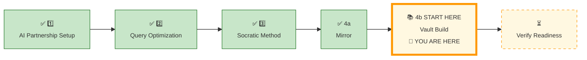
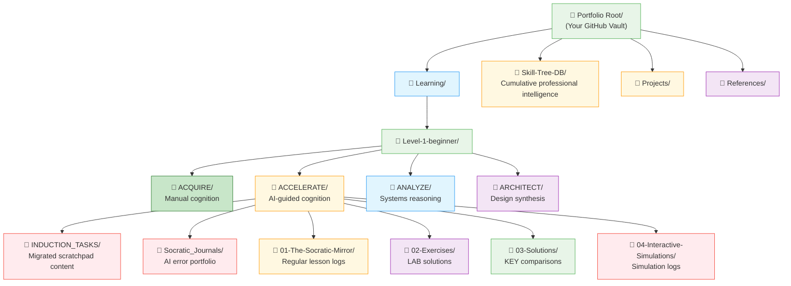
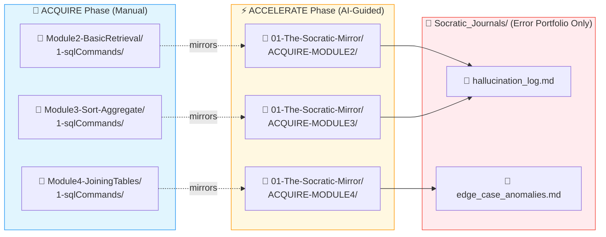
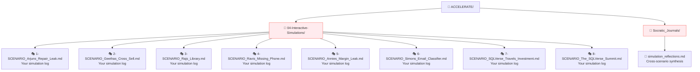
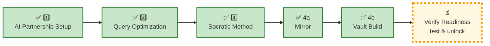

Here is the **complete updated `4b_ACCELERATE_VAULT_BUILD.md`** with all agreed changes applied.

---

```markdown
# 🗄️🤖 SQL & GenAI Course
**🎯 Quality Education for Anyone, Anywhere, Anytime — 💫 with Comfort, Convenience at no Cost**

---

## 📚 **4b KNOWLEDGE BASE: ACCELERATE VAULT BUILD**

### Create Your Knowledge System

Now that you understand the mirror, it’s time to **build**. This page is your action plan – a step‑by‑step guide to creating the folder structure that will house every Socratic prompt, AI dialogue, and simulation log.

*Your Vault is not storage. It is an **operational knowledge retrieval system**.*

Now, roll up your sleeves and build.

---

## 📍 **YOUR PILLAR PROGRESSION**
**Current Status:** Pillar 1-3 ✅ Complete • Pillar 4 in progress. Mirror understood ✅ • Now building the Vault



---

## 🎯 **Quick Win Promise**

**In the next 20 minutes,** you will build your ACCELERATE Vault – a professional, **queryable extension** of your brain. You will know exactly where every Socratic prompt, every AI dialogue, and every optimisation insight will live – and how to **retrieve** them in **seconds.**

**Your Goal:** To commission your ACCELERATE Knowledge Base – a living archive that mirrors the course structure and captures your **evolution** from **manual coder** to **AI‑accelerated Artisan.**

---

## 🧠 Your Externalised Cognitive Map

<div style="border: 3px solid #9c27b0; border-radius: 10px; padding: 20px; margin: 25px 0; background: linear-gradient(135deg, #f3e5f5 0%, #e1bee7 100%);">

**Your Vault is not storage – it is your externalised cognitive map.**

*When you can retrieve any concept in seconds, you have mastered the system.*

</div>

---

## 📐 **The Four Views of Your ACCELERATE Knowledge Architecture**

We will examine your ACCELERATE Vault through four progressive views, zooming from the professional portfolio down to your daily workspace.

### 🏗️ Your Task – Build the Vault

**Set up the folder structure shown in the four views below.** This will become your ACCELERATE Vault – a place where you can find every Socratic prompt, AI dialogue, and simulation log in seconds. 

Without structure, retrieval becomes friction. With structure, knowledge becomes operational. You will navigate your knowledge as fluidly as you navigate a well‑organised library.

Build these folders in your Vault (Tab 4) as you study each view.

---

### 🔭 View 1: Bird’s‑Eye View – The Portfolio Root (ACQUIRE + ACCELERATE)



---

### 📂 What to Create for View 1

In your Vault (Tab 4), create this folder structure:

```
Portfolio Root/
├── Learning/
│   └── Level-1-beginner/
│       ├── ACQUIRE/          # Your manual work (already exists)
│       ├── ACCELERATE/       # NEW – create this folder
│       ├── ANALYZE/          # (future phase)
│       └── ARCHITECT/        # (future phase)
├── Skill-Tree-DB/            # Your queryable portfolio (already exists from ACQUIRE)
├── Projects/
└── References/
```

**Action:** Create the `ACCELERATE/` folder inside `Learning/Level-1-beginner/`. Do not copy any course files – this folder is for **your work only**.

---

**What this signals engineering discipline:** A well‑architected learning system demonstrates **operational retrieval** and **knowledge continuity** – qualities that translate directly to real‑world data engineering teams.

**How this elevates ACQUIRE:** In ACQUIRE, you learned SQL syntax. Here, you learn **how to organise AI‑assisted work** – a skill that scales to any professional project.

---

### 📐 View 2: Telescopic View – The Socratic Mirror (ACQUIRE vs ACCELERATE Contrast)



**The Contrast:**
- **ACQUIRE folders** are organised by **module number** (Module2, Module3, Module4)
- **ACCELERATE folders** are organised by **concept mirror** (ACQUIRE-MODULE2, ACQUIRE-MODULE3, ACQUIRE-MODULE4)
- The **filenames inside** are identical – but the **folder structure** reflects the phase
- **Regular lesson logs** (Socratic conversations) live directly inside `01-The-Socratic-Mirror/ACQUIRE-MODULEx/` with the same filename as the manual lesson.
- **`Socratic_Journals/`** is reserved **only** for AI mistakes (hallucinations, edge cases).

---
### 📂 What to Create for View 2

Inside your `ACCELERATE/` folder, create:

```
ACCELERATE/
├── INDUCTION_TASKS/                # Dedicated folder for ACCELERATE induction artifacts (migrated scratchpad content)
├── Socratic_Journals/              # AI error portfolio only
├── 01-The-Socratic-Mirror/
│   ├── ACQUIRE-MODULE2/
│   ├── ACQUIRE-MODULE3/
│   └── ACQUIRE-MODULE4/
├── 02-Exercises/
│   ├── MODULE2/
│   ├── MODULE3/
│   └── MODULE4/
├── 03-Solutions/
│   ├── MODULE2/
│   ├── MODULE3/
│   └── MODULE4/
└── 04-Interactive-Simulations/
```

**Action:** Create all folders above. The `ACQUIRE-MODULE2/` etc. folders will contain your **regular Socratic logs**, each with the **exact same filename** as the corresponding ACQUIRE concept file. (See next section for the mapping rule.)

> *`INDUCTION_TASKS/` holds the formalised outputs from your Pillars 1‑3 `Temporary Scratchpad`. All future lesson logs will go into `01-The-Socratic-Mirror/`; `INDUCTION_TASKS/` is a dedicated archive of your ACCELERATE induction journey.*

---

**What this shows:** How ACCELERATE mirrors the ACQUIRE module structure – every concept from Modules 2, 3, and 4 revisited with AI polish.

**Professional Signal:** **Collaboration readiness** – revisiting foundational concepts with a more advanced tool (AI) proves you don’t just “move on”; you deepen your understanding. This is the mark of a craftsman, not a tourist.

**How this elevates ACQUIRE:** You are not learning new SQL. You are learning **how to think about SQL with AI** – using the same databases, the same business problems, and the same characters. ACCELERATE is an **overlay**, not a detour.

---

### 🔬 View 3: Microscopic View – Exercise & Solution Workspace

```mermaid
flowchart TD
    ACCELERATE["📁 ACCELERATE/"]
    
    ACCELERATE --> Exercises["📁 02-Exercises/"]
    ACCELERATE --> Solutions["📁 03-Solutions/"]
    ACCELERATE --> Journals["📁 Socratic_Journals/"]
    
    Exercises --> E2["📁 MODULE2/"]
    E2 --> E2_1["🧪 1-the-sieve-select-LAB.md<br/>Your attempt"]
    E2 --> E2_2["🧪 2-the-where-clause-LAB.md<br/>Your attempt"]
    E2 --> E2_3["🧪 3-logical-operators-LAB.md<br/>Your attempt"]
    E2 --> E2_4["🧪 4-in-between-LAB.md<br/>Your attempt"]
    E2 --> E2_5["🧪 5-like-wildcards-LAB.md<br/>Your attempt"]
    E2 --> E2_6["🧪 6-null-handling-LAB.md<br/>Your attempt"]
    E2 --> E2_7["🧪 7-distinct-aliases-LAB.md<br/>Your attempt"]
    
    Solutions --> S2["📁 MODULE2/"]
    S2 --> S2_1["✅ 1-the-sieve-select-KEY.md<br/>Compare & learn"]
    S2 --> S2_2["✅ 2-the-where-clause-KEY.md<br/>Compare & learn"]
    S2 --> S2_3["✅ 3-logical-operators-KEY.md<br/>Compare & learn"]
    S2 --> S2_4["✅ 4-in-between-KEY.md<br/>Compare & learn"]
    S2 --> S2_5["✅ 5-like-wildcards-KEY.md<br/>Compare & learn"]
    S2 --> S2_6["✅ 6-null-handling-KEY.md<br/>Compare & learn"]
    S2 --> S2_7["✅ 7-distinct-aliases-KEY.md<br/>Compare & learn"]
    
    Journals --> J2["📄 hallucination_log.md<br/>Only AI mistakes"]
    
    style Exercises fill:#f3e5f5,stroke:#9c27b0
    style Solutions fill:#e8f5e8,stroke:#4caf50
    style Journals fill:#ffebee,stroke:#f44336
```



---

### 📂 What to Create for View 3

Inside `02-Exercises/MODULE2/`, create LAB files matching **every concept file** from ACQUIRE Module2 `1-sqlCommands/`:

```
02-Exercises/MODULE2/
├── 1-the-sieve-select-LAB.md
├── 2-the-where-clause-LAB.md
├── 3-logical-operators-LAB.md
├── 4-in-between-LAB.md
├── 5-like-wildcards-LAB.md
├── 6-null-handling-LAB.md
└── 7-distinct-aliases-LAB.md
```

Inside `03-Solutions/MODULE2/`, create matching KEY files:

```
03-Solutions/MODULE2/
├── 1-the-sieve-select-KEY.md
├── 2-the-where-clause-KEY.md
├── 3-logical-operators-KEY.md
├── 4-in-between-KEY.md
├── 5-like-wildcards-KEY.md
├── 6-null-handling-KEY.md
└── 7-distinct-aliases-KEY.md
```

**Action:** Repeat the same pattern for **MODULE3** and **MODULE4** using their respective concept filenames.

> 💡 **Important:** The **regular Socratic logs** (your day‑to‑day AI conversations) go into `01-The-Socratic-Mirror/ACQUIRE-MODULEx/` with the **exact same filename** (no `-LAB` or `-KEY` suffix). The LAB and KEY files here are for **your own testing and validation** – they are not the same as the lesson logs.

---

**What this shows:** The LAB and KEY files – where you practice and validate your AI‑assisted reasoning.

**Why this matters for professional cognition:** Every LAB file represents a **real business problem** solved with AI guidance (not AI code). This builds **engineering discipline** – the ability to lead AI, not follow it.

**How this elevates ACQUIRE:** Same characters, same domains, same databases – but now with AI as your thinking partner.

---

### 🔍 View 4: Detail View – The Simulation Workspace


---
### 📂 What to Create for View 4

Inside `04-Interactive-Simulations/`, create placeholder files for the 8 scenarios:

```
04-Interactive-Simulations/
├── 1-SCENARIO_Arjuns_Repair_Leak.md
├── 2-SCENARIO_Geethas_Cross_Sell.md
├── 3-SCENARIO_Rajs_Library.md
├── 4-SCENARIO_Ravis_Missing_Phone.md
├── 5-SCENARIO_Annies_Margin_Leak.md
├── 6-SCENARIO_Simons_Email_Classifier.md
├── 7-SCENARIO_SQLVerse_Travels_Investment.md
└── 8-SCENARIO_The_SQLVerse_Summit.md
```

**Action:** Create these files. You will fill them with your simulation logs as you complete each scenario.

You may also create `simulation_reflections.md` inside `Socratic_Journals/` for cross‑scenario synthesis – this file is for **higher‑level patterns** you notice across simulations.

---

**What this shows:** The 8 cross‑character role‑play scenarios – the crown jewel of ACCELERATE.

**Auditability & professional readiness:** These simulations are **interview pressure tests**. Each scenario forces you to prompt the AI for logic, write SQL manually, and defend your decisions. A portfolio with these logs and `simulation_reflections.md` proves **collaboration readiness** under ambiguity.

**How this elevates ACQUIRE:** The characters (Arjun, Geetha, Raj, Ravi, Annie, Simon) are the same. The business domains (toll, banking, library, mall, events, expo) are the same. But now you tackle **more complex, ambiguous problems** with AI as your thinking partner. This is where ACQUIRE knowledge becomes **professional intuition**.

---

## 🧠 The “Hallucination Log” – Your AI Error Portfolio

**This is not a regular lesson log. This is your exceptional case portfolio.**

Every time you catch the AI making a mistake – a wrong function, a missing edge case, a logical contradiction, or a hallucinated feature – document it. These entries live in `Socratic_Journals/` as individual markdown files (e.g., `error1.md`, `hallucination_selfjoin.md`) or collected in a single file.

Use the **[`AI_ERROR_HALLUCINATION_LOG.md`](../../Modules/Module5-GenAI-Walkthrough/AI_ERROR_HALLUCINATION_LOG.md)** template to structure each entry.

### Example Entry

```markdown
# Entry: 2025-05-21 – `TOP 5` hallucination

**What the AI said:**  
*“Use `SELECT TOP 5 product_name FROM products ORDER BY price DESC;`”*

**What was actually correct:**  
SQLite does not support `TOP`. Use `LIMIT 5` at the end of the query:  
`SELECT product_name FROM products ORDER BY price DESC LIMIT 5;`

**How I caught it:**  
I remembered that `TOP` is SQL Server syntax and asked: *“Is that valid SQLite?”*

**What I learned:**  
Always verify engine‑specific syntax. When in doubt, ask for the official SQLite documentation.

**Source context:**  
- Concept: LIMIT clause  
- Database: level1_estore_basic.db
```

**Why this is portfolio gold:**  
Showing that you caught and corrected an AI error is **more valuable** than showing a perfect query. It proves you are **the pilot, not the passenger**.

> *“Perfect queries are expected. Catching AI mistakes is exceptional – and it’s what builds engineering discipline.”*

---

## 📓 The Three Pillars of Logging Mastery

During Pillars 1–3, you practiced three logging principles without worrying about permanent storage. Now that your Vault exists, here are those three disciplines formalised:

| Pillar | What It Means | Where It Is Applied in Your Vault |
|--------|---------------|-----------------------------------|
| **1. Architecture Paths** | Different types of logs live in different places. | – Regular lesson logs → `01-The-Socratic-Mirror/ACQUIRE-MODULE*/` (1:1 filename mapping)<br>– AI error portfolio → `Socratic_Journals/`<br>– Induction artifacts → `INDUCTION_TASKS/` |
| **2. Quick Summary Format** | A standard template for all regular lesson logs. | See `Module5-GenAI-Walkthrough/SOCRATIC_LOG_TEMPLATE.md` – use it for every entry in `01-The-Socratic-Mirror/`. |
| **3. Error Hub Clean** | Only AI mistakes go into `Socratic_Journals/`. Regular dialogues never go there. | Use `AI_ERROR_HALLUCINATION_LOG.md` template. Hallucination catches are portfolio gold – keep them separate. |

These three disciplines are now **embedded in your Vault structure**. You will use them for all future ACCELERATE work.

---

## 🏛️ From Scratchpad to Structured Vault

**You have already generated valuable cognitive artifacts during Pillars 1–3.** Your `Temporary Scratchpad` holds raw Socratic dialogues, AI responses, and reflections.

Now you will **transform those scattered notes into a structured retrieval system** – your permanent ACCELERATE Vault. This is not a folder exercise. It is a **professional knowledge consolidation event**.

### Migration: Collect Your Gemstones

Open your `Temporary Scratchpad` and extract the following **key artifacts** from each pillar. For each, create a new markdown file inside `ACCELERATE/INDUCTION_TASKS/`. Use the suggested filenames (or invent your own – the important thing is that you know where to find them).

| From Pillar | Artifact | Suggested Filename |
|-------------|----------|---------------------|
| **Pillar 1 (AI Partnership Setup)** | Tool Mastery Challenge – 3‑Part Boundary Test (prompt discipline, journal entry, guardrail recall) | `boundary_test.md` |
| **Pillar 1** | Your first Socratic log (if you practiced the template) | `first_socratic_log.md` |
| **Pillar 2 (Query Optimization)** | Tool Mastery Challenge – indexing dialogue (full table scan vs index, trade‑offs) | `optimization_patterns.md` |
| **Pillar 3 (Socratic Method)** | Tool Mastery Challenge – your Socratic prompt + AI’s response + validation checklist | `socratic_prompt_exercise.md` |
| **Any pillar** | Any additional insight or dialogue you want to preserve | `insightful_note.md` |

> *These are suggestions, not prescriptions. The goal is to capture what you learned, not to fill a quota.*

### Example: Migrated Log from Pillar 2

Here is how a migrated log from the **Query Optimization** challenge might look after reformatting using the Quick Summary Format:

```markdown
# 🪵 Socratic Log: Indexing Trade‑offs

### 🧭 Context Anchor
* **Target Database:** `enrollments` (1M rows)
* **Core Concept:** Full table scan vs index lookup

### 🪜 The Inquiry Ladder
* **The Structural Question:** “What is the fundamental logical difference between a full table scan and an indexed lookup when I’m searching for a specific `course_id`?”
* **AI Guidance Path:** The AI explained that a full table scan touches every row, while an index uses a B‑Tree to jump directly to matching rows. It also highlighted the trade‑off: indexes make `SELECT` faster but `INSERT`/`UPDATE` slower.

### 🛠️ Verified Implementation
*(No SQL – this was a conceptual dialogue.)*

### 📋 The Entry Delta
- **Before:** I thought indexes were always good, with no downside.
- **After:** I now understand the write‑performance penalty. Indexes are tools – use them when reads dominate writes.
```

### Final Migration Steps

1. Create the folder `ACCELERATE/INDUCTION_TASKS/` (if you haven’t already).
2. For each artifact listed above, copy the relevant content from your `Temporary Scratchpad` into a new markdown file inside that folder.
3. Where possible, reformat using the **Quick Summary Format** (see `SOCRATIC_LOG_TEMPLATE.md`).
4. If you caught any AI hallucinations during Pillars 1‑3, ensure they are logged in `Socratic_Journals/` using the `AI_ERROR_HALLUCINATION_LOG.md` template. They do **not** belong in `INDUCTION_TASKS/`.
5. (Optional) Archive or delete your original `Temporary Scratchpad` – you now have a structured home for your induction work.

> *“Capture first. Structure later. Retrieve forever.”*

---

## 🛠️ The “Logic‑First” Commit Strategy

In a professional environment, **how you save your work** is as important as the work itself. Your Vault is your portfolio – and your commit history tells a story.

**Practice Atomic Commits:** Save one logical unit of work at a time.

**Example – After completing `1-the-sieve-select.md`:**

```text
feat: logic-mapped SELECT strategy for 50-column tables via Socratic prompt
```

**Commit Message Pattern:**
| Prefix | Use Case |
|--------|----------|
| `feat:` | New logic, new strategy, new insight |
| `fix:` | Correcting a previous misunderstanding |
| `docs:` | Updating comments, README, or journal entries |
| `refactor:` | Restructuring your notes without changing meaning |

> *“A clean commit history demonstrates operational retrieval and knowledge continuity.”*

---

## ✅ **Knowledge Base Validation Test**

<div style="border: 3px solid #4caf50; border-radius: 10px; padding: 25px; margin: 30px 0; background: linear-gradient(135deg, #e8f5e8 0%, #f1f8e9 100%); box-shadow: 0 8px 20px rgba(76, 175, 80, 0.2);">

### 🧪 **The Archivist's Readiness Audit – ACCELERATE Edition**

**Objective:** Confirm your ACCELERATE Vault is calibrated for active, professional use.

#### 📋 Self‑Assessment Checklist:
- [ ] **The four‑view structure** is understood – I can explain the purpose of each zoom level.
- [ ] **The isomorphic mapping** is clear – I know that `01-The-Socratic-Mirror/` mirrors the ACQUIRE `1-sqlCommands/` folder.
- [ ] **I understand the 1:1 mapping** – my regular lesson logs go into `01-The-Socratic-Mirror/` with the **same filename** as the manual lesson.
- [ ] **I know `Socratic_Journals/` is for AI mistakes only** – not daily conversations. I have created `hallucination_log.md` and understand the template.
- [ ] **I have created the folder structure** for `ACCELERATE/` as shown in the four views.
- [ ] **I have my Quick Summary Format template** ready to use (see `SOCRATIC_LOG_TEMPLATE.md`).
- [ ] **I have migrated my Tool Mastery Challenge outputs** to `ACCELERATE/INDUCTION_TASKS/`.
- [ ] **I have reformatted at least one entry** using the Quick Summary Format.
- [ ] **I have confirmed that any AI errors** are logged in `Socratic_Journals/` – not in `INDUCTION_TASKS/`.

#### 🎯 Final Confidence Check:
Look at your ACCELERATE Vault. Can you immediately find:

1. The folder for your regular lesson logs (e.g., `1-the-sieve-select.md`)?
2. The `hallucination_log.md` file inside `Socratic_Journals/`?
3. The LAB exercise file for `1-the-sieve-select`?
4. The solution KEY for `LEFT JOIN`?
5. The simulation scenario for Raj’s Library?

If the path is instantly clear, your calibration is complete. Your ACCELERATE knowledge now has a permanent, logical home.

</div>

---

## 🚀 **Your Calibration Navigation Journey**

**Complete ALL 4 pillars before proceeding to verification:**



---

## 🔄 Navigation Controls

**⬅️ Previous Step:** [4a ACCELERATE MIRROR](./4a_ACCELERATE_MIRROR.md)

**➡️ Next Step:** [Verify Readiness →](../../Guides/SECTION2_INDUCTION_FINISH.md)

<div align="center" style="border: 3px solid #ff9800; border-radius: 10px; padding: 25px; margin: 30px 0; background: linear-gradient(135deg, #fff8e1 0%, #ffe0b2 100%); box-shadow: 0 8px 20px rgba(255, 152, 0, 0.2);">

You understand the mirror. Now it’s time to **build your ACCELERATE Vault**.

# [▶️ **NEXT: VERIFY READINESS TO UNLOCK MODULE 5**](../../Guides/SECTION2_INDUCTION_FINISH.md)

**Complete the verification test to unlock Module 5**

<small>⏱️ *Estimated time: 5-10 minutes*</small>

</div>

**🚫 Module 5 remains locked until you pass the verification test.**

---

*Part of our mission for 🎯 Quality Education for Anyone, Anywhere, Anytime — 💫 with Comfort, Convenience at no Cost.*

**Level 1 | ACCELERATE Phase | Knowledge Base Commissioned | Ready for Module 5**
```

---

This is the **final `4b_ACCELERATE_VAULT_BUILD.md`** with all agreed modifications. You can copy‑paste it directly into your repository. Let me know if any further tweaks are needed.
